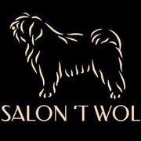

# Trimsalon 't Wolleke

<p align="center">
  
</p>

<div align="center">

**Website voor [Trimsalon 't Wolleke](https://www.twolleke.be)** — hondenverzorging in Slijpe (Middelkerke).

[](https://www.twolleke.be)

[Site](https://www.twolleke.be) · [Voor &amp; na](https://www.twolleke.be/voor-en-na.html) · [Tips](https://www.twolleke.be/hondenverzorging.html)

</div>

Statische HTML-site. Geen build.

## Lokaal

```bash
npx --yes serve .
```

## Bestanden

| Bestand | Wat |
| --- | --- |
| `index.html` | Home |
| `voor-en-na.html` | Resultaten |
| `hondenverzorging.html` | Tips |
| `favicon.ico` / `apple-touch-icon.png` | Iconen |
| `llms.txt` | Machine-readable beschrijving |
| `sitemap.xml`, `robots.txt` | SEO |

Taal: Nederlands. Afspraken via WhatsApp of telefoon.
